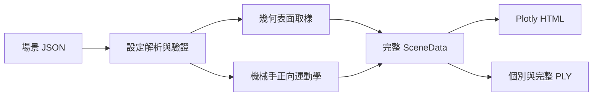

# SimGrasp3D Lab

以 Python 建立的 3D 空間、點雲與機器手臂抓取模擬學習專案。專案目前不依賴實體設備，先用可重現的幾何場景理解座標轉換、機構尺寸、點雲取樣與互動式 3D 視覺化。

作者：`zack7515`

> 目前階段：幾何與點雲場景原型。尚未加入物理引擎、碰撞求解、逆向運動學或自動抓取策略，因此輸出不代表實機抓取結果。

## 目前可以做什麼

- 由 JSON 定義桌面、物件、六軸機械手、夾爪與虛擬 RGB-D 相機。
- 依公尺尺寸產生盒體、圓柱、球體及機械手表面點雲。
- 計算序列式機械手正向運動學與 TCP 世界座標。
- 在瀏覽器中旋轉、縮放及切換物件、機械手、座標軸與相機視錐。
- 將各實體與完整場景匯出為 ASCII PLY，供 Open3D、CloudCompare 等工具使用。
- 使用固定 random seed 重現相同場景，並以測試驗證幾何與輸出行為。

更完整的相機方案、工業作法、抓取管線、論文與決策分析請閱讀 [3D 機器人抓取學習筆記](LEARNING_NOTES.md)。

## 快速開始

需求：Python 3.11 以上。

```bash
python3 -m venv .venv
source .venv/bin/activate
python -m pip install --upgrade pip
python -m pip install -e ".[dev]"
```

產生預設場景並以瀏覽器開啟：

```bash
simgrasp3d --open
```

若不需要自動開啟瀏覽器：

```bash
simgrasp3d
```

也可以使用開發用入口：

```bash
python scripts/run_scene.py
```

## 執行結果

預設會產生：

```text
outputs/
├── tabletop_scene.html       # 可離線開啟的互動式 3D 場景
└── point_clouds/
    ├── complete_scene.ply    # 合併後的完整場景點雲
    ├── blue_box.ply          # 個別物件點雲
    ├── orange_cylinder.ply
    ├── green_sphere.ply
    └── ...                   # 機械手各連桿、關節與夾爪點雲
```

`outputs/` 是可重建產物，已由 Git 忽略，不會進入版本歷史。

## 專案結構

```text
simgrasp3d-lab/
├── configs/scenes/           # 場景、尺寸、姿態與相機設定
├── data/                     # 感測方案與研究比較表
├── references/               # 外部文件、論文及 benchmark 來源
├── scripts/                  # 開發用執行入口
├── src/simgrasp3d/
│   ├── geometry/             # 幾何取樣與 3D 齊次座標轉換
│   ├── io/                   # 點雲檔案輸出
│   ├── models/               # 場景設定資料模型與驗證
│   ├── robot/                # 機械手正向運動學與幾何建立
│   ├── scene/                # 場景載入與組合
│   ├── visualization/        # Plotly 互動式 3D 視覺化
│   └── cli.py                # `simgrasp3d` 命令列流程
├── tests/                    # 幾何、取樣、場景與匯出測試
├── CONTRIBUTING.md           # 協作、隱私與提交規範
├── LEARNING_NOTES.md         # 3D 感知與機器人抓取研究筆記
├── pyproject.toml            # 套件、相依套件與測試設定
└── README.md                 # 專案入口與使用說明
```

## 主要檔案與功能

| 路徑 | 功能 | 修改時機 |
|---|---|---|
| `configs/scenes/tabletop_demo.json` | 定義場景單位、seed、桌面、物件、機械手、夾爪及相機 | 調整尺寸、姿態、關節角或點數時 |
| `src/simgrasp3d/models/specs.py` | 將 JSON 轉成具型別的設定物件，並檢查尺寸、顏色、單位及必要欄位 | 新增場景欄位或物件種類時 |
| `src/simgrasp3d/geometry/transforms.py` | 建立平移、旋轉、姿態矩陣，轉換點座標並對齊圓柱方向 | 擴充座標系或姿態運算時 |
| `src/simgrasp3d/geometry/sampling.py` | 對盒體、圓柱與球體表面取樣，提供點雲容器與邊界計算 | 新增幾何形狀或取樣方法時 |
| `src/simgrasp3d/robot/kinematics.py` | 計算各關節 frame、TCP，以及建立連桿、關節和夾爪點雲 | 修改機構模型或運動學時 |
| `src/simgrasp3d/scene/builder.py` | 載入設定、建立所有實體、相機座標與視錐，組成完整場景 | 加入感測、燈光或場景元素時 |
| `src/simgrasp3d/visualization/plotly_viewer.py` | 建立互動式圖層、座標軸、hover 資訊與 HTML | 改善視覺呈現或除錯資訊時 |
| `src/simgrasp3d/io/point_cloud.py` | 清理檔名並輸出個別或合併的 ASCII PLY | 支援 PCD、二進位 PLY 或其他格式時 |
| `src/simgrasp3d/cli.py` | 串接設定載入、場景建立、HTML/PLY 輸出與瀏覽器開啟 | 新增命令列參數或工作流程時 |
| `scripts/run_scene.py` | 尚未安裝 CLI 時的簡易執行入口 | 本機開發與快速除錯時 |
| `tests/` | 驗證轉換矩陣、表面取樣、固定 seed、場景結構與 PLY 標頭 | 修改核心幾何或輸出邏輯後 |
| `data/*.csv` | 保存相機方法、工程評分與公開實驗的可機讀資料 | 更新研究比較與證據時 |
| `references/sources.md` | 保存官方文件與研究來源 | 新增或查核外部資料時 |

## 程式流程



目前產生的是所有幾何表面的 ground-truth 點雲，不是虛擬相機實際可見的點雲。相機視錐目前用於理解相機姿態與視野，尚未執行投影、遮擋或深度量測。

## 調整場景

預設設定位於 [`configs/scenes/tabletop_demo.json`](configs/scenes/tabletop_demo.json)。所有長度均使用公尺，姿態角使用度數：

- `pose.xyz`：實體中心在世界座標中的 `(x, y, z)`。
- `pose.rpy_deg`：依 roll、pitch、yaw 定義姿態。
- `dimensions` / `size`：物件或桌面的實際尺寸。
- `joint_axis` / `joint_angle_deg`：旋轉關節軸與角度。
- `translation`：目前關節旋轉後，到下一關節的局部位移。
- `opening`：平行夾爪開口。
- `point_count` / `points_per_link`：視覺化點數；越高越細緻，也越耗記憶體與瀏覽器效能。
- `seed`：控制隨機表面取樣；相同設定與 seed 會產生相同點雲。

使用其他設定檔與輸出位置：

```bash
simgrasp3d \
  --config configs/scenes/tabletop_demo.json \
  --output outputs/custom_scene.html \
  --point-cloud-dir outputs/custom_clouds
```

只建立 HTML、不匯出 PLY：

```bash
simgrasp3d --no-export-point-clouds
```

查看所有參數：

```bash
simgrasp3d --help
```

## 測試

```bash
pytest
```

測試範圍包括：

- 平移、旋轉與點座標轉換。
- 盒體、圓柱及球體表面取樣是否符合幾何邊界。
- 固定 seed 的場景是否可重現。
- 關節、連桿與 TCP 結構是否一致。
- 物件是否位於桌面上方。
- PLY 匯出格式是否具有正確標頭。

## 資料與文件

| 文件 | 內容 |
|---|---|
| [LEARNING_NOTES.md](LEARNING_NOTES.md) | 2D、RGB-D、工業 3D 相機、座標標定、抓取方法、工業實務、可行性與研究整理 |
| [camera_methods.csv](data/camera_methods.csv) | 各類相機與感測方法的能力、限制和適用情境 |
| [decision_matrix.csv](data/decision_matrix.csv) | 感測方案評分、權重與加權比較 |
| [experiments.csv](data/experiments.csv) | 公開研究及實機實驗索引 |
| [sources.md](references/sources.md) | 官方文件、論文與 benchmark 來源清單 |
| [CONTRIBUTING.md](CONTRIBUTING.md) | 公開協作、隱私、模擬結果與 commit 規範 |

## 已知限制與開發順序

目前不包含：相機成像與遮擋、深度雜訊、碰撞檢查、IK、路徑規劃、抓取候選、接觸物理及 ROS 2/模擬器整合。

建議依下列順序擴充：

1. 將世界點投影至虛擬相機，使用 z-buffer 產生可見深度圖與 RGB-D 點雲。
2. 加入深度量化、距離相關雜訊、孔洞與外參誤差，比較 ground truth 與 observation。
3. 加入桌面分割、物件點雲、AABB/OBB、表面法向與抓取候選。
4. 加入夾爪碰撞、工作空間、IK 與簡化路徑規劃。
5. 再評估接入 PyBullet、MuJoCo、Gazebo 或 Isaac Sim，進行接觸物理與大量模擬。

大量場景訓練時，應將點雲、深度影像與 HTML 視覺化分流：訓練資料採批次及壓縮格式，HTML 僅用於抽樣檢查，避免不必要的 RAM/VRAM 與磁碟開銷。若未來部署到 Jetson，感知模型再依實測瓶頸評估 FP16、TensorRT 與點雲降採樣。

## 協作

提交前請閱讀 [CONTRIBUTING.md](CONTRIBUTING.md)，並啟用 repository hooks：

```bash
git config core.hooksPath .githooks
```

本專案不提交憑證、本機設定、私人資訊、設備序號、大型模型權重或工具署名資訊；所有結果需清楚標示為模擬或實機資料。
