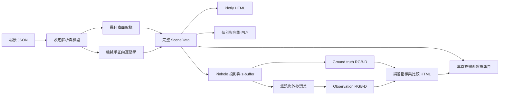

# SimGrasp3D Lab

以 Python 建立的 3D 空間、點雲與機器手臂抓取模擬學習專案。專案目前不依賴實體設備，先用可重現的幾何場景理解座標轉換、機構尺寸、點雲取樣與互動式 3D 視覺化。

作者：`zack7515`

> 目前階段：幾何、點雲與 RGB-D 感測原型。尚未加入物理引擎、碰撞求解、逆向運動學或自動抓取策略，因此輸出不代表實機抓取結果。

## 目前可以做什麼

- 由 JSON 定義桌面、物件、六軸機械手、夾爪與虛擬 RGB-D 相機。
- 依公尺尺寸產生盒體、圓柱、球體及機械手表面點雲。
- 計算序列式機械手正向運動學與 TCP 世界座標。
- 在瀏覽器中旋轉、縮放及切換物件、機械手、座標軸與相機視錐。
- 將各實體與完整場景匯出為 ASCII PLY，供 Open3D、CloudCompare 等工具使用。
- 以 pinhole 相機和 z-buffer 產生可見 RGB、深度、instance mask 與彩色點雲。
- 注入深度量化、距離相關雜訊、隨機孔洞及相機外參偏移，比較 ground truth 與 observation。
- 使用固定 random seed 重現相同場景，並以測試驗證幾何與輸出行為。

更完整的相機方案、工業作法、抓取管線、論文與決策分析請閱讀 [研究與學習筆記](research/README.md)。

## 快速開始

需求：Python 3.11 以上。

```bash
python3 -m venv .venv
source .venv/bin/activate
python -m pip install --upgrade pip
python -m pip install -r requirements.txt
```

產生預設場景並以瀏覽器開啟：

```bash
simgrasp3d --open
```

若不需要自動開啟瀏覽器：

```bash
simgrasp3d
```

也可以使用開發用入口：

```bash
python scripts/run_scene.py
```

## 執行結果

預設會產生：

```text
outputs/
├── simulation_report.html    # 原始世界與感測結果的單頁雙畫面報告
├── tabletop_scene.html       # 可離線開啟的互動式 3D 場景
├── point_clouds/
│   ├── complete_scene.ply    # 合併後的完整場景點雲
│   ├── blue_box.ply          # 個別物件點雲
│   ├── orange_cylinder.ply
│   ├── green_sphere.ply
│   └── ...                   # 機械手各連桿、關節與夾爪點雲
└── sensor/
    ├── ground_truth_frame.npz     # 理想 RGB-D frame
    ├── observation_frame.npz      # 含雜訊與孔洞的 RGB-D frame
    ├── ground_truth_visible.ply   # 理想相機可見點雲
    ├── observation_visible.ply    # 使用名義外參回投影的觀測點雲
    ├── metrics.json               # 深度誤差、覆蓋率與外參擾動
    └── rgbd_comparison.html       # RGB、深度與誤差互動比較頁面
```

`outputs/` 是可重建產物，已由 Git 忽略，不會進入版本歷史。

建議優先開啟 `outputs/simulation_report.html`。左側是原始 3D 世界，右側是同一場景的 RGB-D ground truth、observation、絕對誤差與 RGB；頁首會列出測試條件，頁面下方包含全部量化指標。執行 `simgrasp3d --open` 時只會開啟這份整合報告，不再彈出兩個分離頁面。

## 專案結構

```text
simgrasp3d-lab/
├── configs/scenes/           # 場景、尺寸、姿態與相機設定
├── research/                 # 研究筆記、比較資料與來源索引
│   ├── data/                 # 感測方案與研究比較表
│   ├── references/           # 外部文件、論文及 benchmark 來源
│   └── README.md             # 3D 感知與機器人抓取研究筆記
├── scripts/                  # 開發用執行入口
├── src/simgrasp3d/
│   ├── geometry/             # 幾何取樣與 3D 齊次座標轉換
│   ├── io/                   # 點雲檔案輸出
│   ├── models/               # 場景設定資料模型與驗證
│   ├── robot/                # 機械手正向運動學與幾何建立
│   ├── scene/                # 場景載入與組合
│   ├── sensors/              # RGB-D 投影、z-buffer 與感測誤差
│   ├── visualization/        # Plotly 互動式 3D 視覺化
│   └── cli.py                # `simgrasp3d` 命令列流程
├── tests/                    # 幾何、取樣、場景與匯出測試
├── CONTRIBUTING.md           # 協作、隱私與提交規範
├── pyproject.toml            # 套件、相依套件與測試設定
└── README.md                 # 專案入口與使用說明
```

## 主要檔案與功能

| 路徑 | 功能 | 修改時機 |
|---|---|---|
| `configs/scenes/tabletop_demo.json` | 定義場景單位、seed、桌面、物件、機械手、夾爪及相機 | 調整尺寸、姿態、關節角或點數時 |
| `src/simgrasp3d/models/specs.py` | 將 JSON 轉成具型別的設定物件，並檢查尺寸、顏色、單位及必要欄位 | 新增場景欄位或物件種類時 |
| `src/simgrasp3d/geometry/transforms.py` | 建立平移、旋轉、姿態矩陣，轉換點座標並對齊圓柱方向 | 擴充座標系或姿態運算時 |
| `src/simgrasp3d/geometry/sampling.py` | 對盒體、圓柱與球體表面取樣，提供點雲容器與邊界計算 | 新增幾何形狀或取樣方法時 |
| `src/simgrasp3d/robot/kinematics.py` | 計算各關節 frame、TCP，以及建立連桿、關節和夾爪點雲 | 修改機構模型或運動學時 |
| `src/simgrasp3d/scene/builder.py` | 載入設定、建立所有實體、相機座標與視錐，組成完整場景 | 加入感測、燈光或場景元素時 |
| `src/simgrasp3d/sensors/rgbd.py` | 定義 `RGBDFrame`，執行投影、z-buffer、回投影及深度／外參誤差模擬 | 修改相機模型或真實資料轉接格式時 |
| `src/simgrasp3d/visualization/plotly_viewer.py` | 建立互動式圖層、座標軸、hover 資訊與 HTML | 改善視覺呈現或除錯資訊時 |
| `src/simgrasp3d/visualization/rgbd_viewer.py` | 比較理想深度、觀測深度、絕對誤差與 RGB | 分析感測品質時 |
| `src/simgrasp3d/visualization/simulation_report.py` | 將原始 3D 世界、感測比較、測試條件與全部指標組成單頁雙畫面報告 | 調整整合報告資訊或版面時 |
| `src/simgrasp3d/io/point_cloud.py` | 清理檔名並輸出個別或合併的 ASCII PLY | 支援 PCD、二進位 PLY 或其他格式時 |
| `src/simgrasp3d/io/rgbd_frame.py` | 讀寫壓縮 NPZ、可見點雲及 JSON 模擬指標 | 匯入真實資料或擴充 schema 時 |
| `src/simgrasp3d/cli.py` | 串接設定載入、場景建立、HTML/PLY 輸出與瀏覽器開啟 | 新增命令列參數或工作流程時 |
| `scripts/run_scene.py` | 尚未安裝 CLI 時的簡易執行入口 | 本機開發與快速除錯時 |
| `tests/` | 驗證轉換矩陣、表面取樣、固定 seed、場景結構與 PLY 標頭 | 修改核心幾何或輸出邏輯後 |
| `research/README.md` | 彙整 3D 感知、抓取方法、工業實務與模擬規劃 | 閱讀或補充研究筆記時 |
| `research/data/*.csv` | 保存相機方法、工程評分與公開實驗的可機讀資料 | 更新研究比較與證據時 |
| `research/references/sources.md` | 保存官方文件與研究來源 | 新增或查核外部資料時 |

## 程式流程



完整場景 PLY 仍是所有取樣表面的 ground truth；`outputs/sensor/` 則是經相機投影與 z-buffer 後的可見資料。第一版使用離散表面點投影，不是 mesh triangle rasterization，因此影像填充率會受 `point_count` 影響，不能把空白像素全都解讀成真實相機失效。

### RGBDFrame v1.0

每個 `.npz` 使用同一資料契約：

| 欄位 | dtype / shape | 定義 |
|---|---|---|
| `rgb` | `uint8 [H,W,3]` | 對齊深度的 RGB |
| `depth_m` | `float32 [H,W]` | 米制 z-depth，`0` 表示無效 |
| `instance_mask` | `uint16 [H,W]` | `0` 為背景，其餘值對應 `instance_names` |
| `intrinsics` | `float64 [3,3]` | pinhole 相機內參 `K` |
| `camera_to_world` | `float64 [4,4]` | 名義光學相機座標到世界座標的轉換 |
| `instance_names` | Unicode array | instance id 到名稱的對照 |
| `frame_id` | Unicode scalar | `ground_truth` 或 `observation` |

光學相機採 OpenCV 慣例：x 向右、y 向下、z 向前。`observation` 的 `camera_to_world` 刻意保存系統認知的名義外參；實際擾動後的外參另存於 `metrics.json`，因此其回投影點雲能呈現校正誤差。

### 第一個固定測試情境

- 狀態：固定式 eye-to-hand 相機觀察靜態桌面、三個基本物件與六軸機械手。
- 輸入：`tabletop_demo.json` 的公尺制完整表面點雲，`seed=7515`。
- 相機：160×120、垂直 FOV 52°、近裁切 0.12 m、遠裁切 1.75 m。
- Ground truth：名義外參、無深度雜訊，z-buffer 保留每個像素最近點。
- Observation：實際相機姿態加入外參擾動，深度加入距離相關雜訊、1 mm 量化及 2% 隨機孔洞；回投影仍使用名義外參。
- 測試目的：先隔離相機資料流程，不在同一輪混入桌面估計、抓取候選、IK 或接觸物理。

使用目前設定執行 `simgrasp3d` 的固定結果：

| 指標 | 結果 |
|---|---:|
| 影像像素 | 19,200 |
| Ground-truth 有效像素 | 4,180（21.77%） |
| Observation 有效像素 | 4,080（21.25%） |
| 共同有效像素 | 3,536（保留 84.59%） |
| 注入深度孔洞 | 68 |
| 外參平移誤差範數 | 1.259 mm |
| 外參旋轉誤差範數 | 0.141° |
| 共同像素深度 MAE | 7.71 mm |
| 共同像素深度 RMSE | 19.84 mm |
| 共同像素絕對誤差 P95 | 60.52 mm |

較大的邊界誤差同時包含外參偏移後「不同表面落到同一像素」的影響，不等同於相機軸向 noise standard deviation。完整數值以每次輸出的 `outputs/sensor/metrics.json` 為準。

## 調整場景

預設設定位於 [`configs/scenes/tabletop_demo.json`](configs/scenes/tabletop_demo.json)。所有長度均使用公尺，姿態角使用度數：

- `pose.xyz`：實體中心在世界座標中的 `(x, y, z)`。
- `pose.rpy_deg`：依 roll、pitch、yaw 定義姿態。
- `dimensions` / `size`：物件或桌面的實際尺寸。
- `joint_axis` / `joint_angle_deg`：旋轉關節軸與角度。
- `translation`：目前關節旋轉後，到下一關節的局部位移。
- `opening`：平行夾爪開口。
- `point_count` / `points_per_link`：視覺化點數；越高越細緻，也越耗記憶體與瀏覽器效能。
- `seed`：控制隨機表面取樣；相同設定與 seed 會產生相同點雲。
- `camera.width` / `camera.height`：RGB-D 輸出解析度，需與 `aspect_ratio` 一致。
- `camera.noise.depth_quantization_m`：深度量化間距。
- `camera.noise.axial_noise_std_base_m` / `axial_noise_std_per_m2`：基礎與距離平方相關的軸向雜訊。
- `camera.noise.dropout_probability`：有效深度被改成孔洞的機率。
- `camera.noise.extrinsic_*`：相機平移與旋轉外參的標準差。

使用其他設定檔與輸出位置：

```bash
simgrasp3d \
  --config configs/scenes/tabletop_demo.json \
  --output outputs/custom_scene.html \
  --point-cloud-dir outputs/custom_clouds \
  --report-output outputs/custom_report.html
```

只建立 HTML、不匯出 PLY：

```bash
simgrasp3d --no-export-point-clouds
```

略過 RGB-D 感測模擬：

```bash
simgrasp3d --no-simulate-rgbd
```

查看所有參數：

```bash
simgrasp3d --help
```

## 測試

```bash
pytest
```

測試範圍包括：

- 平移、旋轉與點座標轉換。
- 盒體、圓柱及球體表面取樣是否符合幾何邊界。
- 固定 seed 的場景是否可重現。
- 關節、連桿與 TCP 結構是否一致。
- 物件是否位於桌面上方。
- PLY 匯出格式是否具有正確標頭。
- z-buffer 是否保留同像素最近點，以及深度能否正確回投影。
- 深度雜訊、量化、外參擾動是否固定 seed 重現。
- `RGBDFrame` 壓縮 NPZ 是否能無損往返。
- 單頁報告是否同時包含原始世界、感測畫面、測試情境與所有 metrics，且不依賴外部 script。

## 資料與文件

| 文件 | 內容 |
|---|---|
| [research/README.md](research/README.md) | 2D、RGB-D、工業 3D 相機、座標標定、抓取方法、工業實務、可行性與研究整理 |
| [camera_methods.csv](research/data/camera_methods.csv) | 各類相機與感測方法的能力、限制和適用情境 |
| [decision_matrix.csv](research/data/decision_matrix.csv) | 感測方案評分、權重與加權比較 |
| [experiments.csv](research/data/experiments.csv) | 公開研究及實機實驗索引 |
| [real_world_datasets.csv](research/data/real_world_datasets.csv) | 可用真實 RGB-D／點雲資料、測試用途與限制 |
| [sources.md](research/references/sources.md) | 官方文件、論文與 benchmark 來源清單 |
| [CONTRIBUTING.md](CONTRIBUTING.md) | 公開協作、隱私、模擬結果與 commit 規範 |

## 已知限制與開發順序

目前已完成第一版相機投影、點式 z-buffer、深度／外參誤差、`RGBDFrame` 與比較指標。尚未包含 mesh rasterization、真實資料集 adapter、桌面分割、碰撞檢查、IK、路徑規劃、抓取候選、接觸物理及 ROS 2/模擬器整合。

建議依下列順序擴充：

1. **已完成第一版**：世界點投影、z-buffer、可見深度與 RGB-D 點雲。
2. **已完成第一版**：深度量化、距離相關雜訊、孔洞、外參誤差與比較指標。
3. 下一步：先為 `RGBDFrame` 實作桌面分割、物件點雲與 AABB，再加入 OBB、法向及抓取候選。
4. 接著加入夾爪碰撞、工作空間、IK 與簡化路徑規劃。
5. 最後依接觸精度與批次效能需求，評估 PyBullet、MuJoCo、Gazebo 或 Isaac Sim。

大量場景訓練時，應將點雲、深度影像與 HTML 視覺化分流：訓練資料採批次及壓縮格式，HTML 僅用於抽樣檢查，避免不必要的 RAM/VRAM 與磁碟開銷。若未來部署到 Jetson，感知模型再依實測瓶頸評估 FP16、TensorRT 與點雲降採樣。

## 協作

提交前請閱讀 [CONTRIBUTING.md](CONTRIBUTING.md)，並啟用 repository hooks：

```bash
git config core.hooksPath .githooks
```

本專案不提交憑證、本機設定、私人資訊、設備序號、大型模型權重或工具署名資訊；所有結果需清楚標示為模擬或實機資料。
