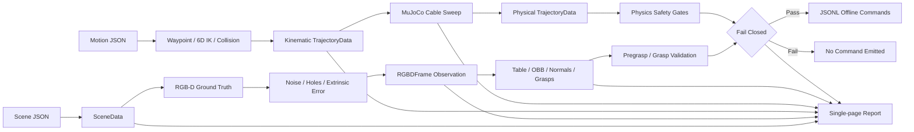

# SimGrasp3D Lab

以 Python 建立的 3D 空間感知、機器手臂與柔性軟管抓取模擬學習專案。專案不需要實體設備，透過可重現的場景、RGB-D、點雲、六自由度 IK、碰撞檢查與 MuJoCo 接觸物理，逐層理解從「看見」到「安全產生命令」的完整流程。

作者：`zack7515`

> 目前版本完成 Stage 1～7 的第一版學習基準。所有結果都是 simulation-only，不代表實機抓取成功率、工業安全認證或材料校正結果。

## 功能總覽

| 模組 | 已實作內容 | 主要輸出 |
|---|---|---|
| 3D 世界 | 公尺制桌面、物件、管路、六軸機械手、夾爪與相機 | 互動式 HTML、ASCII PLY |
| RGB-D | pinhole 投影、z-buffer、instance mask、量化、雜訊、孔洞及外參偏移 | `RGBDFrame` NPZ、可見點雲、誤差指標 |
| 幾何運動 | 軟管連續動作、六自由度 IK、flange/TCP、機器人膠囊碰撞及單 waypoint 搜尋 | `TrajectoryData` NPZ、動畫、規劃指標 |
| 接觸物理 | MuJoCo cable、彎曲／扭轉、重力、摩擦、抓持約束、能量及參數敏感度 | 物理動畫、軌跡、敏感度 JSON |
| 3D 感知 | RANSAC 桌面、物件點雲、AABB／OBB、局部法向及 top-down grasp | 幾何 JSON、物件 PLY、互動圖 |
| 安全整合 | 簡化 URDF/SRDF、pregrasp/grasp IK、碰撞與物理安全閘門 | fail-closed 摘要、JSONL 離線重播 |
| 驗證報告 | 世界、感測、動作、物理、感知與控制結果整合 | 單一自包含 HTML |

研究背景、相機方案、工業實務、公開資料集與來源請閱讀 [research/README.md](research/README.md)。

## 學習路線與進度

| Stage | 學習目標 | 狀態 |
|---:|---|---|
| 1 | 建立世界座標、尺寸、點雲與機器手臂 FK | 已完成第一版 |
| 2 | 建立虛擬 RGB-D、z-buffer 與感測誤差 | 已完成第一版 |
| 3 | 建立軟管連續夾取、搬運與動畫資料 | 已完成第一版 |
| 4 | 加入六自由度 IK、機器人尺寸碰撞與 waypoint | 已完成第一版 |
| 5 | 加入 MuJoCo 接觸物理與 solver sensitivity | 已完成第一版 |
| 6 | 由 RGB-D observation 估計桌面、物件幾何與抓取候選 | 已完成第一版 |
| 7 | 加入 URDF/SRDF、fail-closed 安全閘門與離線控制重播 | 已完成第一版 |

這表示預定的基礎學習路線已走完，不表示系統已達實機部署條件。下一輪應聚焦真實 RGB-D adapter、非 oracle 分割、軟管材料校正、連續 swept-volume 規劃及 ROS 2／MoveIt 2 整合。

## 快速開始

需求：Python 3.11 以上。目前物理基準使用 MuJoCo 3.12.x；不需要 CUDA 或 GPU。

```bash
python3 -m venv .venv
source .venv/bin/activate
python -m pip install --upgrade pip
python -m pip install -r requirements.txt
```

執行完整流程：

```bash
simgrasp3d
```

完成後開啟整合報告：

```text
outputs/simulation_report.html
```

若希望程式自動開啟瀏覽器：

```bash
simgrasp3d --open
```

未安裝命令列入口時可使用：

```bash
python scripts/run_scene.py
```

完整流程在一般 CPU 上會比純幾何模擬慢，主要成本是四組 MuJoCo 參數案例與自包含 Plotly HTML。大量資料產生時應關閉不需要的模組與視覺化。

## 預設輸出

`outputs/` 是可重建產物，已由 Git 忽略。

```text
outputs/
├── simulation_report.html       # 全部結果的單頁報告
├── tabletop_scene.html          # 完整 3D 世界
├── hose_motion.html             # 幾何軟管動畫
├── point_clouds/                # 世界與各實體 PLY
├── sensor/
│   ├── ground_truth_frame.npz
│   ├── observation_frame.npz
│   ├── ground_truth_visible.ply
│   ├── observation_visible.ply
│   ├── metrics.json
│   └── rgbd_comparison.html
├── motion/
│   ├── trajectory.npz
│   └── metrics.json
├── physics/
│   ├── hose_physics.html
│   ├── comparison.html
│   ├── trajectory.npz
│   ├── metrics.json
│   └── sensitivity.json
├── perception/
│   ├── geometry.html
│   ├── geometry.json
│   └── objects/*.ply
└── integration/
    ├── learning_arm.urdf
    ├── learning_arm.srdf
    ├── replay.jsonl
    └── summary.json
```

整合報告依序呈現：A 原始世界、B RGB-D 比較、C 物理或幾何軟管動畫、D 物理敏感度、E 3D 感知及 F fail-closed 重播。它是抽樣檢查工具，不適合當大量訓練資料格式。

## 專案結構

```text
simgrasp3d-lab/
├── configs/
│   ├── scenes/                  # 世界、相機與機器手臂
│   ├── motions/                 # 軟管、管路與動作關鍵幀
│   ├── physics/                 # MuJoCo 材料、solver 與敏感度
│   ├── perception/              # 平面、OBB、法向與抓取參數
│   └── integration/             # fail-closed 安全門檻
├── research/
│   ├── data/                    # 相機、決策、實驗及資料集表格
│   ├── references/              # 官方文件與論文來源
│   └── README.md                # 研究與學習筆記
├── scripts/                     # 開發用入口
├── src/simgrasp3d/
│   ├── geometry/                # 轉換、取樣與解析碰撞
│   ├── models/                  # 場景、動作、物理、感知與整合模型
│   ├── scene/                   # 場景載入與組合
│   ├── sensors/                 # RGB-D 投影與雜訊模型
│   ├── perception/              # 3D 幾何感知管線
│   ├── robot/                   # FK/IK、碰撞及 URDF/SRDF
│   ├── simulation/              # 幾何軟管、waypoint 與 MuJoCo
│   ├── integration/             # 安全閘門與離線重播
│   ├── visualization/           # Plotly 視覺化及整合報告
│   ├── io/                      # NPZ、JSON、JSONL、PLY 匯出
│   └── cli.py                   # 完整工作流程
├── tests/                       # 單元與跨模組回歸測試
├── CONTRIBUTING.md              # 協作、隱私與提交規則
├── requirements.txt             # 可重建開發環境入口
└── pyproject.toml               # 套件版本與依賴範圍
```

## 主要設定與程式

| 路徑 | 功能 |
|---|---|
| `configs/scenes/tabletop_demo.json` | 桌面、物件、六軸手臂、夾爪、相機與雜訊 |
| `configs/motions/hose_extraction_demo.json` | 49 節點軟管、三根管路、11 個關鍵幀與安全餘量 |
| `configs/physics/hose_mujoco_baseline.json` | cable 材料、摩擦、時間步長與三組敏感度案例 |
| `configs/perception/rgbd_geometry_baseline.json` | RANSAC、OBB trim、法向鄰域與夾爪幾何 |
| `configs/integration/fail_closed_baseline.json` | IK、距離、力、穿透與抓持誤差上限 |
| `src/simgrasp3d/sensors/rgbd.py` | 世界點投影、z-buffer、回投影與感測誤差 |
| `src/simgrasp3d/simulation/hose_motion.py` | 可解釋的幾何軟管基準 |
| `src/simgrasp3d/simulation/mujoco_hose.py` | 無視窗 MuJoCo cable 模擬與參數掃描 |
| `src/simgrasp3d/perception/geometry_pipeline.py` | 桌面、包圍盒、法向與抓取候選 |
| `src/simgrasp3d/integration/replay.py` | 候選 IK／碰撞驗證與 fail-closed 事件流 |
| `src/simgrasp3d/robot/description.py` | 簡化 URDF/SRDF 產生器 |
| `src/simgrasp3d/visualization/simulation_report.py` | 將所有模組組成單頁報告 |

## 資料流



抓取候選的 pregrasp/grasp IK 驗證與軟管搬運軌跡重播目前是兩個獨立基準；系統沒有宣稱已用感知候選實際抓起該剛體物件。

## 資料契約

### RGBDFrame v1.0

| 欄位 | shape | 定義 |
|---|---|---|
| `rgb` | `uint8 [H,W,3]` | 對齊深度的 RGB |
| `depth_m` | `float32 [H,W]` | z-depth，`0` 表示無效 |
| `instance_mask` | `uint16 [H,W]` | 模擬 instance id，`0` 為背景 |
| `intrinsics` | `float64 [3,3]` | pinhole 相機內參 |
| `camera_to_world` | `float64 [4,4]` | 名義光學相機到世界座標轉換 |
| `instance_names` | Unicode array | instance id 名稱表 |

光學座標使用 OpenCV 慣例：x 向右、y 向下、z 向前。Observation 以名義外參回投影，實際注入的外參擾動記錄在 `sensor/metrics.json`。

### TrajectoryData v3.0

幾何與物理求解器共用同一契約；舊有欄位保留，新物理欄位在幾何模式使用預設值。

| 欄位群 | 內容 |
|---|---|
| 時間與狀態 | `time_s`、`phase`、`attached`、`gripper_opening_m` |
| 機器人 | `tcp_position`、`tcp_rotation`、`tool_frame`、`joint_angles_deg`、`robot_joint_positions` |
| 柔性物 | `hose_nodes`、`hose_length_ratio`、`hose_clearance_m` |
| IK 與碰撞 | 位置／姿態誤差、連桿／夾爪／總距離 |
| 物理接觸 | 接觸數、最大接觸力、最深接觸距離、自接觸統計 |
| 物理狀態 | 位能、動能、抓持約束誤差、engine 與 solver 名稱 |

NPZ 不使用 pickle，方便 notebook 或其他 Python 程式安全載入。`metrics.json` 保存彙整結果與規劃來源。

## 預設基準結果

下列數值來自固定設定與 seed，可作回歸參考；實際輸出以本機 `outputs/**/metrics.json` 為準。

| 層級 | 代表結果 |
|---|---|
| RGB-D | Observation 4,080 有效點；深度 MAE 7.71 mm；RMSE 19.84 mm |
| 幾何動作 | 116 幀／9.6 s；1 個自動 waypoint；最大 IK 1.77 mm／0.26° |
| 機器人安全 | 最小環境距離 5.59 mm；警示 0 幀；碰撞 0 幀 |
| MuJoCo | 3,363 physics steps；最大抓持誤差約 8.50 mm；無 NaN/Inf |
| 3D 感知 | 桌面 RMS 約 3.27 mm；3 個物件；6 個候選；1 個幾何可行候選 |
| 安全重播 | 預設基準通過全部閘門並輸出 116 個離線命令事件 |

接觸力僅在 12 Hz 軌跡輸出幀抽樣，不代表物理子步進的真正峰值。敏感度案例包含低彎曲剛度、低摩擦與粗時間步長，用來暴露參數依賴，不用來證明材料正確。

## 命令列控制

指定個別設定與輸出位置：

```bash
simgrasp3d \
  --config configs/scenes/tabletop_demo.json \
  --motion-config configs/motions/hose_extraction_demo.json \
  --physics-config configs/physics/hose_mujoco_baseline.json \
  --perception-config configs/perception/rgbd_geometry_baseline.json \
  --integration-config configs/integration/fail_closed_baseline.json \
  --report-output outputs/custom_report.html
```

按成本略過模組：

```bash
simgrasp3d --no-export-point-clouds
simgrasp3d --no-simulate-rgbd
simgrasp3d --no-simulate-motion
simgrasp3d --no-simulate-physics
simgrasp3d --no-analyze-perception
simgrasp3d --no-build-replay
```

依賴關係如下：物理需要幾何動作；感知需要 RGB-D；安全重播同時需要物理與感知。關閉上游時，下游會自然略過。

查看全部選項：

```bash
simgrasp3d --help
```

## 測試

```bash
pytest
```

測試涵蓋：

- 3D 轉換、幾何取樣、解析距離、固定 seed 與 PLY。
- RGB-D z-buffer、回投影、雜訊重現性與 NPZ 往返。
- 六自由度 IK、機器人尺寸碰撞、waypoint 及軟管連續性。
- MuJoCo 有限值、長度、抓持、接觸與物理資料匯出。
- 桌面 RANSAC、AABB／OBB、法向及抓取候選。
- URDF/SRDF、正常授權、故障注入、零命令 fail-closed 與 JSONL。
- 單頁報告是否包含世界、感測、物理、感知和控制結果。

## 重要限制

- 物件分割目前使用模擬 `instance_mask` 作為 oracle baseline；未知物件分割尚未實作。
- RGB-D rasterizer 投影離散表面點而非三角網格，填充率會受點數影響。
- MuJoCo 材料參數未用真實軟管校正；相鄰 capsule 會造成假接觸，因此 baseline 關閉 cable 自接觸。
- 接觸力是輸出幀抽樣值，安全閘門僅供教學，不可直接轉為實機力限制。
- waypoint 規劃器每段最多加入一點，尚無連續 swept-volume、完整自碰撞或 OMPL。
- 產生的 URDF/SRDF 是簡化幾何基準，不含 ROS 2 控制器、transmission、真實 CAD 或安全 PLC。
- JSONL 是 message-neutral 離線事件，不會連線或控制真實機器。

## 效能與後續部署

目前 NumPy、MuJoCo 與 Plotly 都可在 CPU 執行，VRAM 使用量為零。批次研究應將物理計算與 HTML 產生分流，僅抽樣輸出 HTML，並把高頻接觸統計保存成壓縮陣列。若日後加入深度網路或 GraspNet 類模型，再依量測結果評估 FP16／TensorRT、點雲降採樣、batch size 與 Jetson 記憶體限制；不應在沒有 profile 前先做 GPU 最佳化。

## 協作與 Git

請先閱讀 [CONTRIBUTING.md](CONTRIBUTING.md)，並啟用 repository hook：

```bash
git config core.hooksPath .githooks
```

專案不提交憑證、本機設定、設備序號、個人路徑、大型模型權重或工具署名資訊。完成本機提交後，由 repository 擁有者自行推送：

```bash
git push origin main
```
