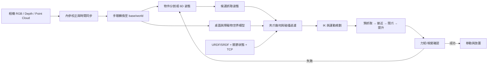

# SimGrasp3D Lab

**以模擬方式學習 3D 空間感知、機器手臂移動、抓取與放置的開源實驗專案。**

作者：`zack7515`

> 資料查核日期：2026-09-01（Asia/Taipei）  
> 專案階段：純模擬研究；目前沒有實體機器手臂、相機或夾爪。  
> 適用情境：在模擬器中研究固定式或桌上型機器手臂，以夾爪或吸盤抓取桌面/料箱物件，再搬運至指定位置。  
> 結論性評分屬於本報告依明確權重建立的工程決策模型，不是跨論文的統一成功率；論文數字只在原實驗條件內解讀。

## 專案定位

SimGrasp3D Lab 的目標不是宣稱已具備實機部署能力，而是建立一套可重現、可逐步擴充的模擬學習環境，用來理解完整的 3D manipulation pipeline：

1. 建立機器手臂、夾爪、桌面、物件與碰撞幾何。
2. 模擬 2D、RGB-D、深度圖與點雲感測。
3. 學習相機座標、世界座標、機器人 base、end effector 與 TCP 的轉換。
4. 實作物件辨識、6D pose、grasp pose generation 與候選排序。
5. 進行 IK、碰撞檢查、路徑規劃、抓取、搬運與放置。
6. 注入深度雜訊、外參偏移、延遲、遮擋與摩擦變化，分析模擬系統如何失敗。
7. 以固定場景、隨機種子、設定檔和指標保留可重現的實驗紀錄。

建議工具鏈為 ROS 2、MoveIt 2，以及 Gazebo 或 NVIDIA Isaac Sim；專案設計保持模擬器可替換，不讓 perception、grasping 與 planning 邏輯綁死於單一平台。

### 結果聲明規則

- 本 repository 產生的抓取成功率、碰撞率、cycle time 與定位誤差，一律標示為 **simulation result**。
- 論文中的實機結果只能作為外部證據引用，不得改寫成本專案已重現的成果。
- domain randomization、sensor noise 與 physics tuning 能縮小 sim-to-real gap，但不能視為實機驗證。
- 若未來加入硬體，實機資料、校正結果與安全驗收必須另立版本與測試範圍。

## Repository 內容

| 路徑 | 用途 |
|---|---|
| `README.md` | 專案定位、技術調研、模擬路線與實驗規劃 |
| `data/camera_methods.csv` | 2D、RGB-D、3D 與混合感測方案比較 |
| `data/decision_matrix.csv` | 工程決策權重與評分定義 |
| `data/experiments.csv` | 已發表研究與實機實驗索引 |
| `references/sources.md` | 官方文件、論文與 benchmark 來源 |
| `CONTRIBUTING.md` | 公開協作、隱私與提交規則 |
| `.githooks/` | 提交前的敏感資訊與 attribution 檢查 |

## 第一個可執行場景

目前第一版 Python 原型已包含：

- 依實際尺寸取樣的盒體、圓柱、球體與桌面表面點雲。
- 具有六個旋轉關節，並可設定關節軸、角度、連桿位移、半徑及夾爪尺寸的簡化序列式機械手。
- 正向運動學、世界/物件/相機/robot base/TCP 座標系。
- 虛擬 RGB-D 相機位置、look-at 目標與視錐。
- 可旋轉、縮放、切換圖層及讀取 XYZ 的自包含 Plotly HTML。
- 每個物件、機械手部件與完整場景的 PLY 點雲輸出。

### 安裝

```bash
python3 -m venv .venv
source .venv/bin/activate
python -m pip install --upgrade pip
python -m pip install -e ".[dev]"
```

### 產生場景

```bash
simgrasp3d --open
```

若環境無法自動開啟瀏覽器：

```bash
simgrasp3d
```

完成後手動開啟：

```text
outputs/tabletop_scene.html
```

點雲會輸出至：

```text
outputs/point_clouds/
├── blue_box.ply
├── orange_cylinder.ply
├── green_sphere.ply
├── learning_arm_base.ply
├── ...
└── complete_scene.ply
```

### 修改尺寸與姿態

編輯 [`configs/scenes/tabletop_demo.json`](configs/scenes/tabletop_demo.json)：

- `dimensions`、`size`、`radius`、`opening` 的單位都是公尺。
- `pose.xyz` 是物件中心在世界座標中的位置。
- `pose.rpy_deg` 使用 roll、pitch、yaw 角度。
- `joint_angle_deg` 修改機械手關節角。
- `translation` 描述旋轉關節後，下一個關節在目前局部座標系中的位移。
- `seed` 固定點雲取樣，使相同設定可完全重現。

例如將藍色盒體改成 20 × 8 × 6 cm：

```json
"dimensions": [0.20, 0.08, 0.06]
```

### 執行測試

```bash
pytest
```

第一版刻意不加入物理引擎、碰撞反應或抓取策略；它先建立可驗證的幾何與座標基礎。下一階段才會加入相機遮擋後的可見點雲、深度雜訊、碰撞檢查與抓取候選。

## 先說結論

1. **相機不會自動知道手臂尺寸。** 手臂連桿、關節限制、夾爪開口、TCP（工具中心點）、碰撞外形要由 URDF/SRDF、CAD、控制器與標定提供。MoveIt 使用 URDF/SRDF 的幾何與運動學模型進行自碰撞及環境碰撞檢查。[MoveIt URDF/SRDF 文件](https://moveit.picknik.ai/main/doc/examples/urdf_srdf/urdf_srdf_tutorial.html)
2. **RGB-D 本身就是 3D 相機的一種。** 業界口語所稱「3D 相機」通常特指輸出深度圖/點雲的工業感測器，例如主動雙目、結構光、ToF 或雷射三角測量；RGB-D 則強調深度與彩色影像對齊。
3. **受控桌面、已知物件、只需由上往下夾：2D 相機可行。** 必須有桌面平面、物件尺寸/CAD 或標記作為尺度來源，且要接受對高度、遮擋和翻轉姿態的限制。
4. **未知物件、隨機姿態或雜亂場景：RGB-D 是原型的最佳起點。** 它能直接產生米制點雲，適合 GraspNet、Contact-GraspNet、AnyGrasp 一類 6-DoF 抓取方法，也能直接餵給 MoveIt 的佔用地圖。
5. **精密裝配、黑亮金屬、反光/透明物件或高可用率量產：工業 3D 或混合感測較可行。** 仍需搭配多視角、深度補全、力矩/觸覺與失敗重試；沒有任何單一光學相機能保證所有材質。
6. **推薦的實務架構是模組化閉迴路。** 固定相機做全域定位，腕上相機做近距離修正，URDF/SRDF 與 Planning Scene 做碰撞規劃，夾爪電流/力矩確認是否抓穩。VLA 可負責語意與高階選擇，但現階段不應取代硬式安全、碰撞與關節限制。

## 問題其實包含五個不同的「知道」

| 系統要知道什麼 | 必要資料/模型 | 典型方法 | 缺少時的後果 |
|---|---|---|---|
| 相機看到的點在機器人哪裡 | 相機內參、畸變、`T_base_camera` 或 `T_ee_camera` | 相機標定、eye-to-hand / eye-in-hand 手眼標定 | 看得到物件，手卻移到錯誤位置 |
| 手臂自身尺寸與可動範圍 | 連桿、關節、關節限制、控制器狀態 | URDF/Xacro、SRDF、FK/IK | 撞自己、超關節限制、IK 無解 |
| 夾爪實際占用空間 | 夾爪 CAD/簡化碰撞網格、開口、指長、TCP、payload | 工具標定、collision mesh、gripper state | 指爪撞桌面/鄰物、抓取點可達但夾爪放不進去 |
| 物件在哪裡及如何抓 | 2D 框/遮罩、深度、6D 物件姿態或直接抓取姿態 | PnP、點雲配準、6D pose、grasp pose detection | 只認出類別，仍不知道三維位置與抓取方向 |
| 搬運路徑是否安全 | 世界模型、桌面/料箱/障礙物、動態更新 | OctoMap/TSDF、Planning Scene、OMPL/Pilz、Servo | 起點和終點正確，但中途碰撞 |

關鍵觀念是：**物件辨識、物件 6D 姿態、抓取姿態、IK 與無碰撞軌跡是不同輸出。** YOLO 類 2D detector 只給框/遮罩，不能單獨完成安全抓取。

### 核心座標鏈

RGB-D 像素轉相機座標的基本關係為：

```text
p_camera = Z(u,v) · K⁻¹ · [u, v, 1]ᵀ
p_base   = T_base_camera · p_camera
```

若物件已有 6D pose，末端抓取目標可寫成：

```text
T_base_grasp = T_base_camera · T_camera_object · T_object_grasp
```

固定相機的 `T_base_camera` 由 eye-to-hand 標定取得；腕上相機則每一時刻使用：

```text
T_base_camera(t) = T_base_ee(t) · T_ee_camera
```

因此，影像模型只要其中一個 transform、深度單位或時間戳錯誤，最後的 TCP 目標都會錯。求得 `T_base_grasp` 後仍需 IK、關節限制、夾爪實體碰撞與路徑規劃，才是可執行動作。

## 參考系統資料流



MoveIt 的感知管線可由點雲或深度圖建立 OctoMap，並要求 TF 將相機資料轉到 world frame；其深度更新器也能利用目前機器人狀態移除畫面中的手臂點雲。[MoveIt 感知管線](https://moveit.picknik.ai/main/doc/examples/perception_pipeline/perception_pipeline_tutorial.html)、[Planning Scene Monitor](https://moveit.picknik.ai/main/doc/concepts/planning_scene_monitor.html)

## 三大相機路線

### A. 一般 2D RGB 相機

可行方法由簡到難如下：

1. **平面假設 + Homography**：標定桌面四角，將像素 `(u,v)` 映射到桌面 `(x,y)`；高度 `z` 固定，夾爪由上往下。最適合扁平、分離、方向容易估計的物件。
2. **已知尺寸/CAD + PnP**：偵測標記或已知 3D 特徵點，利用 3D–2D 對應估計物件 6D pose。OpenCV `solvePnP` 與 `calibrateHandEye` 提供標準實作。[OpenCV calib3d](https://docs.opencv.org/4.13.0/d9/d0c/group__calib3d.html)
3. **RGB 6D pose 模型**：如 MegaPose，以 RGB、物件區域與 CAD 模型估計 novel object 6D pose；適合 SKU/CAD 已知的部署。[MegaPose](https://megapose6d.github.io/)
4. **單眼度量深度**：Depth Anything V2 等模型可輸出 metric depth，但精度受訓練域、焦距、裁切、材質與尺度先驗影響；比較適合建立候選或安全慢速原型，不宜直接當毫米級量測。[Depth Anything V2](https://depth-anything-v2.github.io/)
5. **端到端單眼抓取/VLA**：MonoGraspNet 直接由單張 RGB 預測 6-DoF grasp；OpenVLA、Octo、RT-2 類模型由影像與指令輸出控制動作。這些路線能處理語意與閉迴路，但需要與特定機器人資料分布對齊。[MonoGraspNet](https://sites.google.com/view/monograsp/about)、[OpenVLA](https://openvla.github.io/)

可行性判斷：

- 已知平面、固定高度、上抓：**高**。
- 已知 CAD、紋理充足、單物件：**中高**。
- 未知高度、堆疊、遮擋、精密放置：**低至中**。
- 優勢是成本、解析度、速度與材質色彩；核心風險是單張影像缺乏可靠的絕對尺度和被遮蔽表面幾何。

### B. RGB-D 相機

RGB-D 同時輸出 RGB、每像素深度與相機內參，深度可反投影為點雲。常見消費/研究型裝置使用主動雙目或 ToF；例如 RealSense D400 以左右影像視差計算深度，並可用 IR pattern 改善低紋理場景。[RealSense D400 資料表](https://dev.realsenseai.com/download/42003/)

典型方法：

1. **2D 分割 + 深度反投影**：用 2D 模型找物件遮罩，再以遮罩內點雲估中心、表面法向與尺寸。
2. **已知物件 6D pose**：RGB-D + CAD 使用 FoundationPose、MegaPose RGB-D 或傳統 RGB-D registration/ICP。
3. **未知物直接 6-DoF grasp**：GraspNet baseline、Contact-GraspNet、AnyGrasp 從單視角點雲直接產生平行夾爪候選，再依夾爪尺寸、IK、桌面/點雲碰撞篩選。
4. **多視角融合**：固定相機加腕上相機，或手臂主動移動取得多視角，再用 TSDF/點雲融合降低遮擋。
5. **視覺伺服**：規劃至預抓取點後，持續根據新影像修正末端姿態。MoveIt Servo 提供碰撞、奇異點、平滑與關節限制處理。[MoveIt Servo](https://moveit.picknik.ai/main/doc/examples/realtime_servo/realtime_servo_tutorial.html)

可行性判斷：

- 未知物件、桌面雜物、研究原型：**高，最建議起點**。
- 移動物件：若感測幀率、曝光、推論與控制延遲足夠，**中高**。
- 透明、鏡面、黑色吸光物：原始深度可能破洞或錯誤，**低至中**，需深度補全/多視角/力覺。
- 精密插入：單靠 RGB-D **不足**，最後數毫米應加入視覺伺服、力矩或機械治具。

### C. 工業 3D 相機與多感測融合

工業「3D 相機」並非單一技術：

| 技術 | 原理 | 優點 | 主要限制 | 適合情境 |
|---|---|---|---|---|
| 被動雙目 | 左右影像視差 | 無主動光干擾、可看移動物 | 低紋理/重複紋理困難，精度隨距離下降 | 戶外、移動場景、成本敏感 |
| 主動雙目 | 雙目 + IR 紋理投影 | 即時、價格較低、ROS 生態成熟 | 多機 IR 干擾、陽光、透明/反光、遮擋 | 桌面原型、移動抓取 |
| ToF | 光的飛行時間/相位 | 每像素直接量深、幀率高、較遠距 | multipath、邊界 flying pixels、反射率與環境光 | 人機共作、箱體/較大物件 |
| 時序結構光 | 投射多張編碼圖樣 | 高密度、高精度、低紋理表面佳 | 擷取較慢，場景移動會失真 | 靜態 bin picking、精密定位 |
| 平行結構光 | 單次/平行編碼取得 3D | 可兼顧動態與品質 | 成本與整合複雜度高 | 輸送帶、moving-object picking |
| 雷射三角測量/線掃 | 雷射線與運動形成輪廓 | 高精度、適合檢測 | 需掃描運動，視野與週期受限 | 尺寸檢測、規則產線 |
| 多相機/多視角融合 | 多個視點融合 TSDF/點雲 | 顯著降低遮擋、世界模型完整 | 外參/時間同步與算力成本高 | 深料箱、複雜路徑、量產單元 |

ToF 的實際誤差會受環境光、散射、溫度、多重反射及目標反射率影響。[Basler ToF 原理](https://docs.baslerweb.com/tof-camera-technology) 時序結構光則以多個空間編碼圖樣換取高精度；Zivid 明確將 3D 用於 bin picking、機器人引導、裝配與量測。[Zivid FAQ](https://support.zivid.com/en/latest/camera/support/faq.html) 若物件在移動，可參考平行結構光工業相機的動態模式。[Photoneo MotionCam-3D 規格](https://www.photoneo.com/kb/MC-M-GEN2)

## 相機方案比較表

| 方案 | 絕對尺度 | 可觀測自由度 | 遮擋恢復 | 硬體成本 | 整合難度 | 工程可行性 | 適合的最低條件 |
|---|---:|---|---|---|---|---|---|
| 單 RGB + 平面映射 | 由桌面標定提供 | `(x,y,yaw)`，`z` 固定 | 差 | 低 | 低 | 高（限受控場景） | 物件分離、平放、上抓 |
| 單 RGB + CAD/PnP/6D pose | CAD/已知尺寸提供 | 理論上 6D | 差 | 低 | 中高 | 中高（已知 SKU） | 物件可辨識、紋理/輪廓足夠 |
| 單 RGB + 學習式 metric depth | 網路估計 | 近似 3D/6D | 差 | 低 | 中 | 中（研究/低精度） | 能做場域微調及安全餘量 |
| 被動/主動雙目 | 幾何 baseline 提供 | 稠密/半稠密 3D | 差至中 | 低至中 | 中 | 中高 | 表面有紋理或 IR 投影有效 |
| 消費型 RGB-D | 感測器直接提供 | 稠密 3D + RGB | 差至中 | 中 | 中 | **高（原型首選）** | 工作距離與精度容許匹配 |
| 工業 ToF | 感測器直接提供 | 即時 3D | 中 | 高 | 中 | 高（較大物件/動態） | 可接受毫米級而非亞毫米級 |
| 工業結構光 | 感測器直接提供 | 高品質 3D | 中 | 高 | 中高 | **高（靜態精密）** | 場景在曝光序列中近似靜止 |
| 多視角 3D / RGB-D | 多次量測融合 | 較完整 3D | **佳** | 高 | 高 | 最高但複雜 | 允許多相機或主動觀測時間 |
| 固定 3D + 腕上 RGB-D + 力覺 | 多來源交叉校正 | 全域 + 局部閉迴路 | **佳** | 很高 | 很高 | **量產/高可靠度首選** | 有整合、驗證與維護資源 |

完整可機讀資料位於 [`data/camera_methods.csv`](data/camera_methods.csv)。

## 決策矩陣與資料分析

### 評分定義

- 每項 1–5 分，5 為較有利。
- 權重針對「未知剛性物件、桌面/淺料箱、平行夾爪、需要安全搬運」：
  - 米制幾何可靠度 25%
  - 遮擋恢復 15%
  - 困難材質韌性 10%
  - 動態場景能力 10%
  - 低硬體成本 10%
  - 整合容易度 10%
  - 量產成熟度 20%
- 加權總分是**方案篩選工具**，不是實測成功率。變更任務與權重會改變排名。

| 排名 | 方案 | 加權分數 / 5 | 解讀 |
|---:|---|---:|---|
| 1 | 固定工業 3D + 腕上 RGB-D + 力覺 | 4.10 | 可靠度最佳，但硬體、校正與軟體整合成本最高 |
| 2 | 多視角 RGB-D / 3D 融合 | 3.80 | 遮擋能力突出，適合深料箱與複雜路徑 |
| 3 | 工業時序結構光 | 3.70 | 靜態場景幾何品質高，動態與成本拉低總分 |
| 4 | 消費型 RGB-D | 3.60 | 成本、成熟度和易用性的最佳折衷，最適合第一版 |
| 5 | 已知 CAD/平面的校準 RGB | 3.30 | SKU 固定且環境可控時，非常划算 |
| 6 | 被動雙目 | 3.05 | 動態能力佳，但低紋理與近距幾何仍是風險 |
| 7 | 單 RGB + 學習式深度 | 2.45 | 語意強、幾何弱，較適合研究或輔助感知 |

評分明細與公式位於 [`data/decision_matrix.csv`](data/decision_matrix.csv)。

### 實務建議

| 任務 | 最低可行方案 | 建議量產方案 | 理由 |
|---|---|---|---|
| 扁平零件、固定方向、上抓搬運 | 2D + 平面映射 | 2D + 治具/光源 + 抓取確認 | `z` 與 approach 固定，不必為每像素買深度 |
| 已知 SKU 隨機旋轉、桌面分離 | 2D + CAD/PnP/6D pose | RGB-D + CAD pose + 視覺伺服 | 深度可降低平移尺度與輪廓歧義 |
| 未知日用品、桌面雜亂 | RGB-D + 6D grasp network | 固定 RGB-D + 腕上相機 | 可直接產生抓取姿態並以第二視角修正 |
| 深料箱/嚴重遮擋 | 單工業 3D + 重拍 | 多視角 3D + next-best-view | 單視角永遠看不到背面與被遮住的接觸區 |
| 輸送帶移動物 | 高幀率 RGB-D/ToF | 平行結構光 + tracking + 延遲補償 | 要預測相機曝光到夾取時的物件位置 |
| 透明/鏡面/黑亮物 | RGB + 深度補全 + 低速重試 | 工業 3D、多視角、偏振/力覺、客製治具 | 光學深度的失效不是單純增加模型容量就能消除 |
| 精密插入/對孔 | RGB-D 到預插入位 | 工業 3D + 腕上相機 + 力矩控制 | 最後階段要靠閉迴路與接觸資訊 |
| 開放語意指令、多任務 | RGB/RGB-D + VLA 微調 | VLA 作高階策略，幾何/安全仍模組化 | 可提升泛化，但不可省略機器人模型與安全約束 |

## 手臂「知道自身尺寸」的實作清單

### 1. 機器人模型

- URDF/Xacro：每個 link/joint、視覺 mesh、簡化 collision mesh、質量/慣量、joint limit。
- SRDF：planning group、end effector、home pose、allowed collision matrix。
- 控制器回報的即時關節位置必須與模型一致；不要只信模擬中的初始姿態。
- 碰撞 mesh 應低面數並保守包絡；MoveIt 文件建議碰撞網格遠比視覺網格簡化，以降低碰撞檢查成本。

### 2. 夾爪與工具

- 標定 flange → TCP 的 6D transform。
- 描述手指全開、半開、全閉時的幾何；抓取規劃不能只把 TCP 當成一個點。
- 設定最大開口、最小可夾寬度、指深、夾力、payload、質心與安全 padding。
- 對吸盤記錄杯徑、法向容許角、真空建立時間及表面曲率限制。

### 3. 相機與座標系

- 內參：`fx, fy, cx, cy`、畸變、深度尺度、RGB-depth 外參。
- eye-to-hand：固定相機，求相機相對 robot base 的 pose；視野穩定，適合桌面與料箱。
- eye-in-hand：相機隨末端移動，求相機相對 end effector 的 pose；可主動看遮擋處，但畫面與手臂同步更重要。
- 官方手眼標定定義及輸出 4×4 transform 可參考 [Zivid hand-eye API](https://support.zivid.com/en/latest/camera/api-reference/hand-eye-calibration.html)。
- 標定完成要做 touch test：讓 TCP 實際觸碰相機估計的標定板點，而不是只看 reprojection error。[手眼 Touch Test](https://support.zivid.com/en/v2.8/academy/applications/hand-eye/hand-eye-calibration-verification-via-touch-test.html)

## 主要演算法路線

| 路線 | 輸入 → 輸出 | 優點 | 限制 | 代表作 |
|---|---|---|---|---|
| 解析式/幾何抓取 | 點雲/mesh → 接觸點 + quality | 可解釋、少資料 | 感測噪聲與摩擦模型敏感 | antipodal grasp、force closure、ICP |
| 2D grasp rectangle | RGB/depth → `(u,v,θ,w)` | 快、簡單 | 通常限制 top-down 或平面抓取 | GGCNN、Dex-Net 2.0 |
| 6-DoF/7-DoF grasp detection | 點雲 → `(x,y,z,R,width[,score])` | 可側抓、未知物件 | 點雲破洞、夾爪碰撞與 IK 還需額外處理 | GraspNet、Contact-GraspNet、AnyGrasp |
| 已知物件 pose + 預定義 grasp | RGB/RGB-D + CAD → object pose → grasp | 易控制放置姿態、可重用 CAD grasp | 需 CAD/物件 onboarding，對稱物有多解 | MegaPose、FoundationPose、BOP 系列 |
| 模仿學習/擴散策略 | 多視角影像 + proprioception → action chunk | 閉迴路、能學細緻動作 | 需要同機器人大量示範，分布外風險 | Diffusion Policy、ACT |
| VLA | 影像 + 語言 + robot state → actions | 語意理解、多任務、泛化 | 算力/延遲、資料依賴、安全難驗證 | RT-2、Octo、OpenVLA、π0/π0.7 |

## 現有實驗與證據

答案是**有，而且涵蓋 2D、RGB-D、點雲、透明物、動態抓取與端到端 VLA**。下表只摘錄可由原論文/官方頁面核實的條件；不同列不可用成功率直接排名。

| 年份 | 專案/論文 | 感測與任務 | 實體實驗/資料證據 | 可借鑑程度 |
|---:|---|---|---|---|
| 2017 | [Dex-Net 2.0](https://goldberg.berkeley.edu/pubs/dex-net-2.0-Camera-Ready-RSS-2017.pdf) | RGB-D depth crop，單物件平行夾爪 | ABB YuMi；CEM 版本在其測試集達 94% success、99% precision，平均規劃 2.5 s | 經典 top-down baseline；場景比現代 clutter 簡單 |
| 2020 | [GraspNet-1Billion](https://openaccess.thecvf.com/content_CVPR_2020/papers/Fang_GraspNet-1Billion_A_Large-Scale_Benchmark_for_General_Object_Grasping_CVPR_2020_paper.pdf) | RGB-D、雜亂場景、6D grasp | 97,280 張 RGB-D、190 個場景、88 物件、超過十億 grasp labels，含實機對照 | 建立未知物 6D 抓取與評估的主要基準 |
| 2021 | [Contact-GraspNet](https://github.com/NVlabs/contact_graspnet) | raw point cloud/depth → 6-DoF grasp distribution | 官方程式、模型與實機影片；可搭配未知物分割 | 適合研究原型；舊 TensorFlow/CUDA 依賴需容器化 |
| 2022–2023 | [AnyGrasp](https://arxiv.org/abs/2212.08333) | 點雲、靜態/動態 7-DoF grasp | 超過 300 個 unseen objects 清箱達 93.3%；單臂超過 900 mean picks/hour；另示範抓移動機器魚 | 強烈證明點雲 6D grasp 可落地；授權與 SDK 條件需先查 |
| 2022 | [MegaPose](https://megapose6d.github.io/) | RGB 或 RGB-D + novel-object CAD → 6D pose | 官方展示機器人拍攝、估 pose、執行預先標註 grasp | 已知 CAD/SKU 路線很實用 |
| 2022–2023 | [TransCG](https://github.com/galaxies99/transcg) | 透明物 RGB-D 深度補全與抓取 | 57,715 張 RGB-D、51 個透明物、130 場景，含實機抓取 baseline | 說明透明物需要專門資料/補全，不是一般 RGB-D 直接解決 |
| 2023 | [MonoGraspNet](https://sites.google.com/view/monograsp/about) | 單張 RGB → 6-DoF grasp | ICRA 2023，公開專案、資料與工具 | 證明單眼路線可做，但部署應保留尺度與安全裕度 |
| 2023 | [RT-2](https://deepmind.google/blog/rt-2-new-model-translates-vision-and-language-into-action/) | RGB + 語言 → closed-loop robot action | 超過 6,000 次實機 trials；未見情境由 RT-1 的 32% 提升到 RT-2 的 62% | 證明語意泛化，但非傳統幾何精度保證 |
| 2024 | [FoundationPose](https://nvlabs.github.io/FoundationPose/) | RGB-D + CAD 或 reference views → 6D pose/tracking | CVPR 2024 Highlight；官方可部署模型與機器人 manipulation 案例 | 已知/快速 onboarding 物件的現代基線 |
| 2024 | [Octo](https://octo-models.github.io/) | 多資料集影像/語言/狀態 → actions | 在 4 個機構、9 套真實機器人評估 | 開源 generalist policy 研究起點 |
| 2024 | [OpenVLA](https://openvla.github.io/) | 單/多視角 RGB + 語言 → robot action | 970k episodes 預訓練；WidowX、Google Robot 與微調後 Franka 實驗 | 可自建資料微調，但仍需 robot-specific action normalization |
| 2024–2025 | [BOP Challenge 2024](https://bop.felk.cvut.cz/challenges/bop-challenge-2024/) | RGB/RGB-D，seen/unseen 6D pose | 新增 model-free 6D detection、HOPEv2/HANDAL/HOT3D；結果於 CVPRW 2025 發表 | 評估 6D pose 演算法應優先參考的持續基準 |
| 2026 | [π0.7](https://www.pi.website/download/pi07.pdf) | VLA、多機器人、多任務、語言與組合泛化 | 官方技術報告評估速度、靈巧操作、語言遵循與組合泛化 | 代表前沿方向；量產仍需獨立安全與幾何層 |

可篩選版本位於 [`data/experiments.csv`](data/experiments.csv)。

## 常見失敗模式與對策

| 失敗 | 根因 | 應對 |
|---|---|---|
| 抓取點整體固定偏移 | 手眼外參、robot base 或 TCP 錯 | 重做多姿態手眼標定、touch test、檢查 mm/m 單位 |
| 越遠誤差越大 | 內參/畸變錯、雙目深度誤差隨距離增加 | 在真實工作距離標定與驗證，縮小工作範圍 |
| 夾爪在點雲中消失或障礙出洞 | self-filter 過度、時間不同步 | 同步 joint state、camera timestamp 與 TF；調整 padding |
| 能到抓取 pose 卻撞桌 | 只檢查 TCP，未建夾爪/手指 collision | 建立開合狀態幾何；候選 grasp 要做 swept-volume collision |
| 物件抓起後滑落 | grasp score 未反映重量、摩擦、質心 | 加入質心/材質先驗、力/電流確認、提升後短暫 hold test |
| 放置位置不準 | 只規劃 grasp，未估物件相對夾爪的 transform | 抓後重新觀測或估計 slip；以 object pose 定義 place pose |
| 透明/鏡面深度破洞 | 折射、鏡射、multipath、低回波 | 深度補全、多視角、改拍攝角度/背景、力覺或治具 |
| 動態物抓空 | 感測—推論—規劃—控制延遲 | 全鏈路時間戳、追蹤與前饋預測、短 horizon servo |
| 模型在 demo 成功、換現場失敗 | 資料域、光源、相機噪聲、物件分布改變 | 現場驗證集、domain randomization/微調、失敗回放與分層指標 |

## 建議的第一版模擬系統

第一版建議採用**虛擬固定式 RGB-D + ROS 2 + MoveIt 2 + 平行夾爪**作為 MVP：

1. 在 Gazebo 或 Isaac Sim 建立手臂、夾爪、桌面與隨機化物件場景，相機由上斜看桌面，並預留腕上相機設定。
2. 建立可靠 URDF/SRDF、夾爪開合碰撞模型及 TCP，驗證 self-collision、reachability、joint limits 與控制器介面。
3. 第一階段以模擬器 ground-truth transform 驗證座標鏈；第二階段再注入內參、深度、手眼外參與時間同步誤差。
4. 先實作 2D segmentation + 遮罩點雲 + top-down antipodal grasp，建立可解釋 baseline，不直接從大型 VLA 開始。
5. 第二階段加入 Contact-GraspNet/GraspNet 類 6D grasp proposals，依夾爪幾何、IK、桌面與環境碰撞重新排序。
6. 規劃採 `home → pre-grasp → linear approach → close → lift → verify → transit → place → retreat` 狀態機；線性接近/離開使用 Cartesian、Pilz 或 Servo 控制。
7. 使用固定 random seed 和場景 manifest，量測抓取成功率、任務成功率、碰撞/近碰撞率、cycle time P50/P95、重試率與 pose error。
8. 將結果分成理想感測、感測雜訊、物理隨機化與分布外物件四組，避免只報告最容易的模擬設定。

### 建議驗收門檻（需依風險調整）

下列不是產業通用標準，而是適合實驗專案的起始驗收定義：

- 在預定工作區 3×3 或更密的格點完成 touch-test 誤差圖，而不是只測中央一點。
- 每個物件族群至少分開報告 seen/unseen、單件/clutter、普通/困難材質。
- 抓取成功需定義為「抓起、運輸、穩定持有、正確放置」，不能只算夾爪閉合。
- 所有失敗保存 RGB、depth、point cloud、TF、joint states、grasp candidates、planner result 與 gripper feedback，以便重播。
- 實機控制採 fail-closed：深度無效、TF 過期、碰撞模型缺失或規劃失敗時停止，不以模型信心高低越過安全檢查。

## 部署、速度與 VRAM 建議

- **幾何優先縮小資料量**：先用桌面/料箱 ROI 裁切點雲，再 voxel downsample；不要把整張百萬點點雲送入抓取網路。工業案例也顯示 ROI 可同時降低擷取與推論時間。[Zivid ROI 範例](https://support.zivid.com/en/latest/camera/academy/applications/piece-picking/prepare-for-production.html)
- **分層頻率**：安全/伺服 100–1000 Hz、機器人狀態數十至數百 Hz、視覺 15–60 Hz、全域抓取規劃 1–10 Hz；不要要求大型視覺模型承擔硬即時控制。
- **GPU 併發要受控**：segmentation、pose、grasp、VLA 不宜各自獨占完整 GPU；使用 TensorRT/ONNX、FP16/BF16、固定 batch、CUDA stream 與記憶體池，並量測峰值 VRAM。
- **Jetson/邊緣端**：先選小型 segmentation + point-cloud grasp；FoundationPose/VLA 可放在工作站或透過本地網路服務。機器人停止、限速與碰撞保護必須在邊緣控制器本地完成。
- **Docker**：固定 CUDA、TensorRT、ROS 2、相機 SDK 與模型版本；分成 `camera-driver`、`perception`、`planning`、`robot-driver` 容器，透過 ROS 2 topics/actions 連接，保存每版校正檔雜湊。

## 專案結構

```text
simgrasp3d-lab/
├── configs/
│   └── scenes/           # 場景、尺寸、姿態、相機與機械手設定
├── data/
│   ├── camera_methods.csv
│   ├── decision_matrix.csv
│   └── experiments.csv
├── src/
│   └── simgrasp3d/
│       ├── geometry/     # 齊次轉換與表面點雲取樣
│       ├── models/       # 場景設定資料模型
│       ├── robot/        # 正向運動學與夾爪幾何
│       ├── scene/        # 場景與相機視錐建立
│       ├── io/           # PLY 點雲輸出
│       └── visualization/# Plotly 互動式 3D 頁面
├── scripts/              # 開發用執行入口
├── tests/                # 幾何、運動學、重現性與輸出測試
└── outputs/              # 本機生成結果，不納入 Git
```

## 如何選擇

```text
物件是否都平放、已知高度，而且只需上抓？
├─ 是 → 2D + 平面映射，成本最低
└─ 否
   ├─ 物件 CAD/尺寸是否已知？
   │  ├─ 是 → RGB 6D pose 可做；精度重要時加 RGB-D
   │  └─ 否 → RGB-D/3D + 6D grasp detection
   └─ 是否有嚴重遮擋、反光透明或精密放置？
      ├─ 否 → 單固定 RGB-D 通常足夠做 MVP
      └─ 是 → 工業 3D/多視角 + 腕上相機 + 力覺/治具
```

## 來源索引

研究與工程文件的完整 URL、類型和使用主張整理於 [`references/sources.md`](references/sources.md)。核心來源包括：

- [OpenCV camera calibration / PnP / hand-eye](https://docs.opencv.org/4.13.0/d9/d0c/group__calib3d.html)
- [MoveIt 2 URDF/SRDF](https://moveit.picknik.ai/main/doc/examples/urdf_srdf/urdf_srdf_tutorial.html)
- [MoveIt 2 perception pipeline](https://moveit.picknik.ai/main/doc/examples/perception_pipeline/perception_pipeline_tutorial.html)
- [GraspNet-1Billion](https://openaccess.thecvf.com/content_CVPR_2020/papers/Fang_GraspNet-1Billion_A_Large-Scale_Benchmark_for_General_Object_Grasping_CVPR_2020_paper.pdf)
- [BOP Challenge 2024](https://bop.felk.cvut.cz/challenges/bop-challenge-2024/)
- [FoundationPose](https://nvlabs.github.io/FoundationPose/)
- [AnyGrasp](https://arxiv.org/abs/2212.08333)
- [OpenVLA](https://openvla.github.io/)
